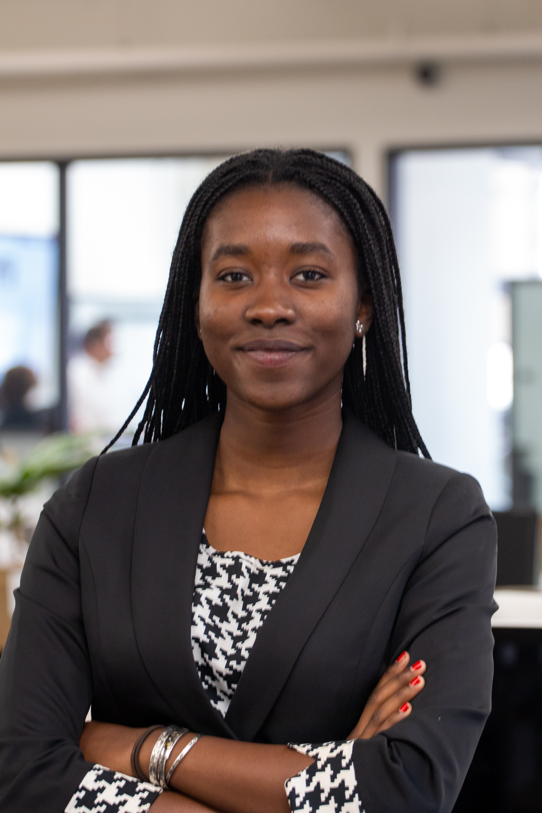

### Hi there 👋, Teddy Diallo
#### Full Stack Development and Entrepreneurship

I am Teddy from Burkina Faso currently living in the US. I am studying full-stack development and entrepreneurial business. I enjoy building things and seeing projects come to life. I am on a journey towards developing mastery in Python and learning frameworks that will make me a programmer capable of building software that is impactful, fun, and easy to use. I am interested in frontend development, backend, and design. I also have interests in project/product management as well as leadership development.

Skills: Python / SQL / R 

- 🔭 I’m currently working on My Git Portfolio 
- 🌱 I’m currently learning JS, CSS and HTML 
- ⚡ Fun fact: I have traveled over 18 countries 

  

